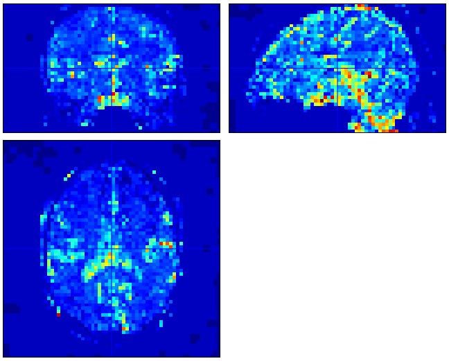

# PhysIO_CBRAIN
PhysIO shell script with fMRI image correction

PhysIO is written by Lars Kasper, University of Zurich and ETH Zurich

Shell script written by Serge Boroday and Darius Valevicius

physio_cli_fmri.m is the shell script. It takes as input an output directory name ('save_dir'), an fMRI run in .nii.gz format ('fmri_data'), a command to correct the image or simply produce physiological regressors ('correct'), and any number of PhysIO parameters, which are specified in the boutiques descriptor and documented in the tapas_physio_new.m script of PhysIO.

Image correction is performed by taking the multiple_regressors.txt output by PhysIO, and subtracting their beta-weighted values from each voxel in the fMRI image. Roughly,

fMRI(corrected) = fMRI(raw) - Betas * multiple_regressors

The output is the multiple_regressors.txt and diagnostic plots from PhysIO, as well as (if 'correct' is set to 'yes') a corrected fMRI image and a pct_var_reduced.nii image which shows the percent variance reduced by the regressors per each voxel. This can be visualized in e.g. SPM.

For example...

# CBRAIN integration
For integration into CBRAIN, the shell script (along with all PhysIO scripts) must be compiled and containerized. Compilation allows for the code to be run without a MATLAB installation or license.

Serge has written a guide for preparing MATLAB tools for CBRAIN [here.](matlab_to_cbrain.md)