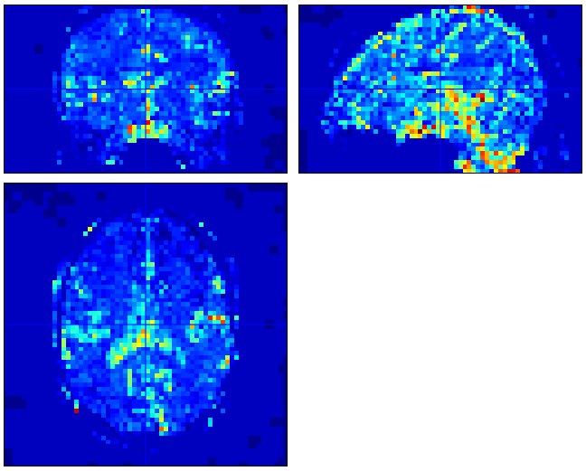

# PhysIO_CBRAIN
PhysIO shell script with automated fMRI image correction. Also included is the Boutiques descriptor for integration into CBRAIN.

PhysIO is written by Lars Kasper, University of Zurich and ETH Zurich. It can be accessed [here.](https://github.com/translationalneuromodeling/tapas)

Shell script written by Serge Boroday and Darius Valevicius.

# Shell script

physio_cli_fmri.m is the shell script. The main purpose of this is to take parameters from the boutiques/CBRAIN interface and pass them to the TAPAS PhysIO toolbox. Secondarily, it can take the output from PhysIO and apply a correction to fMRI BOLD data.

It takes as input input and output directory names ('in_dir' and 'out_dir'), a specification of the input format ('use_case'; see below), an option to correct the image or simply produce physiological regressors ('correct'), and any number of PhysIO parameters, which are specified in the boutiques descriptor and documented in the tapas_physio_new.m script of PhysIO.

Image correction is performed by taking the multiple_regressors.txt output by PhysIO, and subtracting their beta-weighted values from each voxel in the fMRI image. Roughly,

fMRI(corrected) = fMRI(raw) - Betas * multiple_regressors

The output is the multiple_regressors.txt and diagnostic plots from PhysIO, as well as (if 'correct' is set to 'yes') a corrected fMRI image and a pct_var_reduced.nii image which shows the percent variance reduced by the regressors per each voxel. This can be visualized in e.g. SPM.

In the current version of the script, it will scan the input folder for one or more fMRI files (depending on the use case) and automatically find the associated physiological logfiles. For instance, with use_case set to "BIDS_subject_folder", it will assume a BIDS-valid subject directory as input and scan through all 'func' folders for fMRI runs. For "Single_run_folder", it will assume a folder has been input containing the BOLD and physio data for one fMRI run.

If the use case is set to "manual_input", no input directory is necessary, but the user must specify the fmri_file, cardiac logfile, and/or respiration logfile fields.

The outputs will be placed in a new folder under "out_dir". In the case of either one or multiple fMRI runs, all the outputs pertaining to one run will be placed in a subdirectory named after the BOLD file. E.g. sub-02_ses-1_task_run-3.nii.gz would produce the output folder /sub-02_ses-1_task_run-3_physio_results.

Here is an example of a pct_var_reduced output image:

"Hot" areas indicate where a large amount of variance has been accounted for by cardiac and/or respiratory models.

The shell script requires the PhysIO codebase (get [here](https://github.com/translationalneuromodeling/tapas)) to be copied into the project directory.

# CBRAIN integration
For integration into CBRAIN, the shell script (along with all PhysIO scripts) must be compiled and containerized. Compilation allows for the code to be run without a MATLAB installation or license. Containerizing the compiled tool (with Singularity or Docker) allows the tool to be run with all dependencies from any machine.

Serge has written a guide for preparing MATLAB tools for CBRAIN [here.](matlab_to_cbrain.md)

Both compilation and containerization (with Docker) can be done via MATLAB's Compiler Toolkit.

The compiled tool in the current version can be accessed under /standalone_app.

The current version of the docker image can be accessed at https://hub.docker.com/repository/docker/dvalev/tapasphysio or referenced via docker://dvalev/tapasphysio.

# Boutiques descriptor

Also provided in the project files is the boutiques descriptor, tapasphysio.json.

Boutiques is a software package that defines the structure of a command line interface command. cbrain_task_descriptors/tapasphysio.json defines 

Boutiques documentation and installation are available [here.](https://github.com/boutiques/boutiques)
